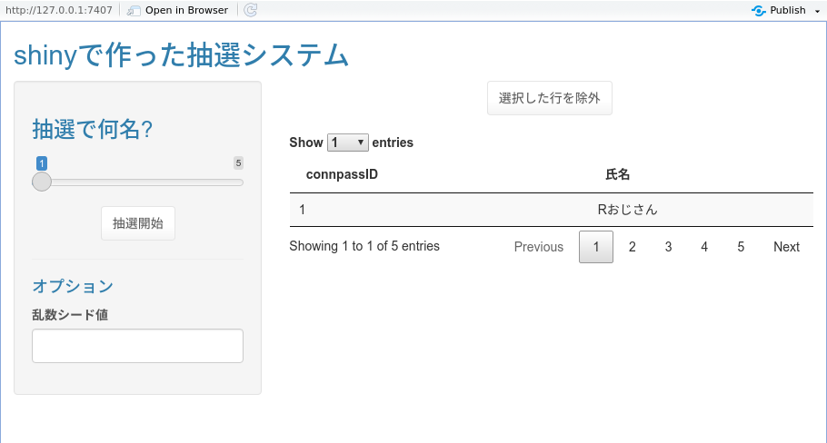

<!-- README.md is generated from README.Rmd. Please edit that file -->

```{r, include = FALSE}
knitr::opts_chunk$set(
  collapse = TRUE,
  comment = "#>",
  fig.path = "man/figures/README-",
  out.width = "100%"
)
```

# lotteRy

<!-- badges: start -->
[](https://www.tidyverse.org/lifecycle/#experimental)
<!-- badges: end -->

Tokyo.R リモート開催時の抽選イベント用パッケージ

```{r echo=F}

```

## インストール方法

CRAN に登録する予定はありません.

``` {r, eval=F}
remotes::install_package("Gedevan-Aleksizde/lotteRy")
```

CRAN に登録されていない `DTedit` パッケージに依存している. もし上記でうまくインストール出来ないなら, 以下で手動インストールする

```{r, eval=F}
remotes::install_github('jbryer/DTedit')
```

* **golem** を使っているがたぶん要らなかった

## 使用法

操作を体感したいだけならば, 以下を実行してください.

```{r example, eval=F}
lotteRy::run_app()
```

実際に使用する場合は以下のような手順になります.


1. `NameList.csv` という名称で抽選対象となる名簿を保存する
    ```
    nomenklatura <- data.frame(
    connpassID = 1:5,
    `氏名` = c("Rおじさん", "R おばさん", "Rおにいさん", "Rボーイ", "究極超人R")
    )
    write.csv(nomenklatura, "NameList.csv", row.names = F)
    ```
    * データフレームとして読み込めるものなら件数や列数は不問です
    * ただし基本的に全ての列がそのまま表示されるので含める列に注意してください
2. 上記 CSV を置いたディレクトリをカレントディレクトリとする
  * 他のフォルダからファイルを参照したい場合, R で `shinyOptions(name.list.path = "/path/to/csv")` のようにしてファイルパスを指定してください
3. R で `lotteRy::run_App()` を実行する

以下の点にも注意してください.

* 名簿を更新した場合は再起動してください
* 使用中にクラッシュした場合, カレントディレクトリに `OrderedResult.csv` というファイル名で最後の抽選順位が保存されています
* タイトルなど一部のデザインは `params.json` を設定することで変更できます

## memo

候補の除外はこういうの使ったほうがいいか?

https://github.com/zzawadz/dragulaR

https://github.com/ayayron/shinydnd
